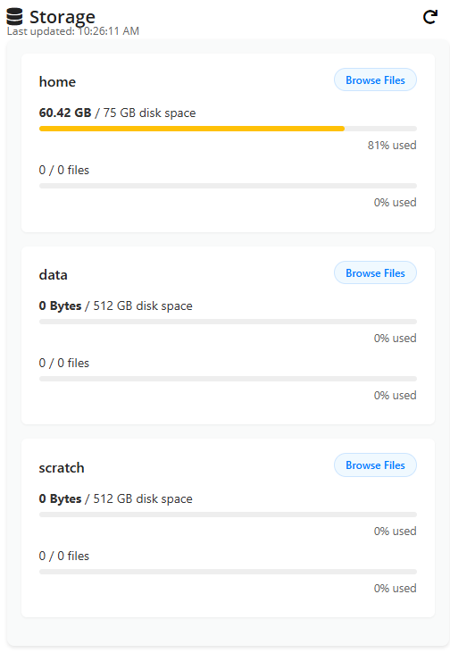

# OnDemand Storage Quota Widget

## About


This repository contains a lightweight, transferable OnDemand storage quota widget that consumes a published JSON snapshot (`dquota.json`), normalizes potentially messy values, and renders per-user quota usage for both block (disk) and file counts. It was built so other sites or institutions can drop it into their dashboards with minimal effort, adapt the source path, and override presentation or heuristics as needed.

Key goals:
- **Simplicity:** Client-side logic reads a JSON file and renders quota info without a heavy backend dependency.  
- **Transferability:** Username resolution, data sanitization, and threshold logic are explicit and easily adjustable.  
- **Resilience:** Handles malformed JSON gracefully (sanitizing common issues) and shows clear fallback messages when data is missing.  
- **Clarity:** Displays per-folder disk usage and file counts with percent bars, human-readable formatting, and “Last updated” timestamps.

## Installation

Clone the repository:

```bash
git clone https://github.com/your-username/ood_quota_widget.git
cd ood_quota_widget
```

Place or customize the widget file (`_quota.html.erb`) to match your environment. You can adjust:
- `JSON_FILE_PATH` if your quota export lives elsewhere.
- Username resolution if your OnDemand installation exposes a different user object.

Create the symlink so the dashboard loads it (adjust path if your OnDemand install differs):

```bash
ln -s _quota.html.erb /etc/ood/config/apps/dashboard/views/widgets/_quota.html.erb
```

Ensure the JSON quota file (by default expected at `public/dquota.json` relative to the widget) is being generated/updated on a cadence (the widget assumes it’s refreshed every ~5 minutes).

## Usage

On page load the widget will:
1. Resolve the current username from the OnDemand context.  
2. Fetch the quota JSON file and sanitize it (fix common formatting issues).  
3. Normalize numeric fields and filter for the current user’s quotas.  
4. Render one entry per storage path with:
   - Disk usage vs limit (human-readable, with colored utilization bar).  
   - File count usage vs limit.  
   - “Browse Files” link tailored to the storage path.  
5. Update a “Last updated:” timestamp.  
6. Support manual refresh via the refresh button.

If no quota data is found for the user, or the JSON fetch/parsing fails, a friendly message appears with guidance to retry shortly.

## Defaults & Behavior

- **Data Sanitization:** The widget attempts to clean potentially malformed JSON (e.g., stray commas, missing separators) before parsing.  
- **Quota Normalization:** Converts missing or non-numeric fields into safe zeros to avoid NaN propagation.  
- **Threshold Coloring:** Disk usage percentage uses:
  - `red` for >= 90%  
  - `yellow` for >= 70%  
  - `green` otherwise  
- **Formatting:**  
  - Byte counts are formatted (KB/MB/GB/TB) with two decimals.  
  - File counts abbreviate large numbers (e.g., `1.2K`, `3.4M`).

## Example CSS Overrides (widget depends on these classes; adapt for branding)

```css
/* Storage entry card */
.storage-entry {
  background: #fff;
  padding: 1rem 1.25rem;
  border-radius: 6px;
  margin-bottom: 1rem;
  box-shadow: 0 1px 2px rgba(0,0,0,0.05);
}

/* Header row with title and browse button */
.storage-header {
  font-weight: 600;
  color: #222;
  margin-bottom: 0.5rem;
  display: flex;
  justify-content: space-between;
  align-items: center;
}

/* Browse link */
.browse-button {
  font-size: 0.75rem;
  background: #f0f9ff;
  border: 1px solid #cce5ff;
  color: #007bff;
  padding: 0.2rem 0.75rem;
  border-radius: 999px;
  cursor: pointer;
  text-decoration: none;
}

/* Usage rows */
.storage-row {
  font-size: 0.875rem;
  color: #333;
  margin-top: 0.25rem;
  margin-bottom: 0.5rem;
}

/* Bar background and fill */
.bar-track {
  background: #eee;
  height: 6px;
  border-radius: 3px;
  margin: 5px 0;
  width: 100%;
  position: relative;
}
.bar-fill {
  height: 100%;
  border-radius: 3px;
}
.bar-fill.green {
  background-color: #4caf50;
}
.bar-fill.yellow {
  background-color: #ffc107;
}
.bar-fill.red {
  background-color: #f44336;
}

/* Percent text */
.usage-percent {
  font-size: 0.8rem;
  color: #666;
  text-align: right;
}

/* Timestamp */
.last-updated {
  font-size: 0.75rem;
  color: #666;
  margin-top: -0.5rem;
}

/* Error / empty states */
.no-data-msg {
  padding: 1rem;
  background: #fff;
  border-radius: 10px;
  font-size: 0.95rem;
  text-align: center;
  color: #555;
}
```

## Configuration

- `JSON_FILE_PATH`: Defaults to `../../../public/dquota.json`. Point this to where your quota exporter writes the JSON snapshot. a script is provided that can be triggered by a cronjob.
- `CURRENT_USER`: Derived from `current_user` if available; falls back to `OodSupport::User.new.name`. Adjust if your environment exposes the user differently.

## Troubleshooting

- **No quota entries for user:** Verify the JSON file contains entries with the expected `user` field matching the current username.  
- **Malformed JSON errors:** The sanitization logic strips common issues, but excessively broken exports may still fail—inspect the raw file.  
- **Incorrect path links:** The “Browse Files” link assumes a particular OnDemand URL structure; update the href template if your instance differs.  
- **Stale data:** Ensure the quota JSON is being regenerated at the intended cadence (every ~5 minutes) and that any caching layer does not serve old copies.

## Contributing

1. Fork the repository.  
2. Improve sanitization logic, support alternative quota sources, or make the widget configurable via `data-` attributes.  
3. Submit a pull request with sample quota JSON and a description of additions.

## License

MIT License — see the `LICENSE` file for details.
